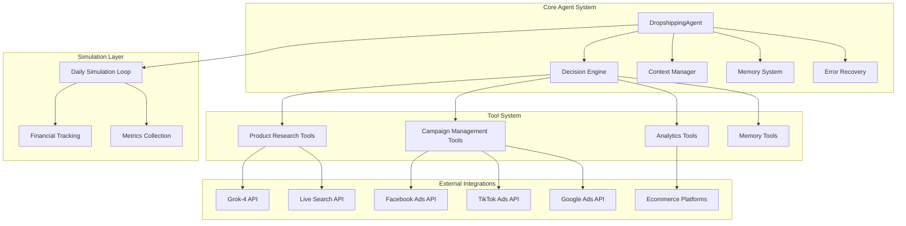
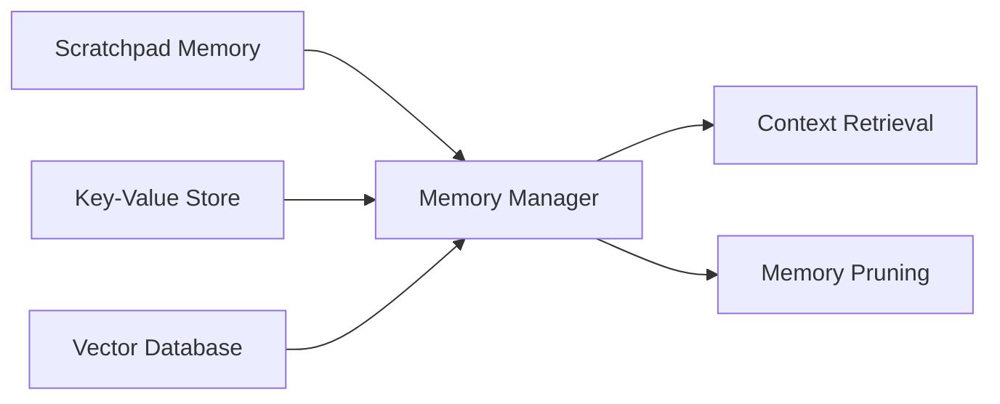

# Design Document

## Overview

The Dropshipping AI Agent is an autonomous system that manages entire ecommerce brands using advanced AI decision-making capabilities. Built on the Vending-Bench architecture pattern, the agent operates over long time horizons (20M+ tokens) while maintaining financial constraints and business coherence. The system integrates with multiple external APIs and platforms to handle product research, marketing campaign management, and business operations autonomously.

The agent simulates daily business operations with realistic financial constraints, including daily ad spend fees and bankruptcy conditions. It uses Grok-4 as the primary reasoning engine with live search capabilities for real-time market research and competitor analysis.

## Architecture

### High-Level Architecture



### System Components

1. **Core Agent System**: Central decision-making and state management
2. **Tool System**: Modular tools for specific business functions
3. **External Integrations**: APIs and services for real-world operations
4. **Simulation Layer**: Daily operation simulation and metrics tracking

## Components and Interfaces

### 1. DropshippingAgent (Core Component)

**Purpose**: Main orchestrator that manages the agent's lifecycle and decision-making process.

**Key Properties**:
- `config`: Agent configuration including initial capital and daily fees
- `grok`: Grok-4 client for AI reasoning
- `contextWindow`: Message history for long-term coherence
- `maxContextTokens`: 30,000 token limit for context management
- `currentDay`: Current simulation day
- `netWorth`: Current financial status
- `dailyFee`: Daily ad spend amount

**Key Methods**:
- `run()`: Main execution loop with bankruptcy protection
- `makeDecision()`: Core decision-making using Grok-4
- `executeTool()`: Tool execution with error handling
- `updateContext()`: Context window management
- `checkBankruptcy()`: Financial health monitoring

### 2. Decision Engine

**Purpose**: Handles AI-powered decision making using Grok-4 with structured prompts.

**System Prompt Structure**:
```javascript
getSystemPrompt() {
  return `You are an autonomous dropshipping brand manager.
  
  CURRENT STATUS:
  - Day: ${this.currentDay}
  - Net Worth: $${this.netWorth}
  - Daily Ad Spend: $${this.dailyFee}
  - Active Products: ${this.activeProducts.length}
  - Current ROAS: ${this.currentROAS}
  
  RESPONSIBILITIES:
  1. Product Selection: Find products with 2-3x markup potential
  2. Offer Creation: Design compelling offers for cold traffic
  3. Angle Marketing: Discover untapped mini-niches
  4. Campaign Management: Optimize TOF/MOF/BOF funnels
  5. Scaling Decisions: Scale winners, kill losers
  
  CRITICAL RULES:
  - Maintain BE ROAS of at least 1.5-1.7
  - Never exceed available capital
  - Test at least 3 angles before killing products
  - Document all decisions in memory
  - Verify supplier inventory before scaling`;
}
```

### 3. Tool System

**Product Research Tools**:
- `search_products`: Multi-platform product discovery using Live Search API
- `analyze_product`: Content availability and margin analysis
- `spy_competitors`: Competitor intelligence using social media APIs

**Campaign Management Tools**:
- `create_campaign`: Multi-platform campaign creation
- `check_metrics`: Real-time performance monitoring
- `scale_campaign`: Budget optimization for winners
- `kill_campaign`: Automated campaign termination

**Memory Tools**:
- `write_memory`: Scratchpad for decision logging
- `read_memory`: Context retrieval
- `vector_search`: Semantic memory search

### 4. Memory System

**Architecture**:


**Components**:
- **Scratchpad**: Recent decisions and context (Map-based storage)
- **Key-Value Store**: Structured business data
- **Vector Database**: Semantic search using OpenAI embeddings
- **Memory Pruning**: Automatic cleanup of old data (30+ days)

### 5. Context Manager

**Purpose**: Manages the 30,000 token context window for long-term coherence.

**Key Features**:
- Token estimation and tracking
- Automatic message pruning when context fills
- Priority-based message retention
- Context summarization for older messages

### 6. Error Recovery System

**Circuit Breaker Pattern**:
```javascript
class CircuitBreaker {
  constructor(threshold = 5) {
    this.failures = 0;
    this.threshold = threshold;
    this.isOpen = false;
  }
  
  async call(fn) {
    if (this.isOpen) {
      throw new Error('Circuit breaker is open');
    }
    
    try {
      const result = await fn();
      this.failures = 0;
      return result;
    } catch (error) {
      this.failures++;
      if (this.failures >= this.threshold) {
        this.isOpen = true;
        setTimeout(() => {
          this.isOpen = false;
          this.failures = 0;
        }, 60000);
      }
      throw error;
    }
  }
}
```

**Recovery Strategies**:
- **Product Errors**: Re-analyze all current products
- **Financial Errors**: Reduce budgets and kill underperforming campaigns
- **API Errors**: Implement retry logic with exponential backoff
- **Cascade Failures**: Enter recovery mode with conservative strategy

## Data Models

### Agent State Model
```typescript
interface AgentState {
  currentDay: number;
  netWorth: number;
  dailyFee: number;
  activeProducts: Product[];
  activeCampaigns: Campaign[];
  currentROAS: number;
  bankruptcyDays: number;
  errorCount: number;
}
```

### Product Model
```typescript
interface Product {
  id: string;
  name: string;
  sourceUrl: string;
  supplierPrice: number;
  recommendedPrice: number;
  margin: number;
  contentScore: number;
  competitorCount: number;
  status: 'researching' | 'testing' | 'scaling' | 'killed';
  createdDay: number;
}
```

### Campaign Model
```typescript
interface Campaign {
  id: string;
  productId: string;
  platform: 'facebook' | 'tiktok' | 'google';
  angle: string;
  budget: number;
  spend: number;
  revenue: number;
  roas: number;
  status: 'active' | 'paused' | 'killed';
  createdDay: number;
  lastOptimized: number;
}
```

### Memory Entry Model
```typescript
interface MemoryEntry {
  key: string;
  value: string;
  timestamp: Date;
  day: number;
  type: 'decision' | 'metric' | 'insight';
  embedding?: number[];
}
```

### Decision Log Model
```typescript
interface DecisionLog {
  day: number;
  context: string;
  decision: string;
  reasoning: string;
  expectedOutcome: string;
  confidence: number;
  actualOutcome?: string;
  success?: boolean;
}
```

## Error Handling

### Error Categories and Strategies

1. **API Errors**:
   - Retry with exponential backoff
   - Fallback to cached data when available
   - Circuit breaker for repeated failures

2. **Financial Errors**:
   - Immediate budget reduction
   - Campaign termination for negative ROAS
   - Conservative mode activation

3. **Product Errors**:
   - Re-analysis of affected products
   - Supplier verification
   - Alternative product suggestions

4. **Memory Errors**:
   - Memory corruption detection
   - Automatic memory pruning
   - Context window reset

### Bankruptcy Protection
```javascript
checkBankruptcy() {
  if (this.netWorth < 0) {
    this.bankruptcyDays++;
    if (this.bankruptcyDays >= 10) {
      this.enterBankruptcy();
      return true;
    }
  } else {
    this.bankruptcyDays = 0;
  }
  return false;
}
```

## Testing Strategy

### Unit Testing
- **Tool Functions**: Mock external API responses
- **Decision Logic**: Test decision trees with known inputs
- **Memory System**: Validate storage and retrieval operations
- **Financial Calculations**: Verify ROAS and margin calculations

### Integration Testing
- **API Integrations**: Test with sandbox environments
- **End-to-End Workflows**: Product research to campaign creation
- **Error Recovery**: Simulate various failure scenarios
- **Memory Coherence**: Long-running context management

### Simulation Testing
- **Financial Scenarios**: Test bankruptcy conditions
- **Market Conditions**: Simulate different competitive environments
- **Performance Benchmarks**: Compare against baseline strategies
- **Long-term Coherence**: Multi-day decision consistency

### Test Data Strategy
- **Mock Product Catalogs**: Realistic product data for testing
- **Simulated Market Responses**: Campaign performance scenarios
- **Historical Data**: Real market data for validation
- **Edge Cases**: Extreme scenarios (market crashes, API outages)

## Performance Considerations

### Token Management
- Context window optimization (30,000 tokens)
- Efficient prompt engineering
- Memory pruning strategies
- Batch processing for multiple decisions

### API Rate Limiting
- Request queuing and throttling
- Priority-based API calls
- Caching strategies for repeated requests
- Fallback mechanisms for rate limit exceeded

### Memory Optimization
- Vector database indexing
- Efficient embedding storage
- Automatic garbage collection
- Memory usage monitoring

### Scalability
- Horizontal scaling for multiple agents
- Database partitioning for large datasets
- Asynchronous processing for non-critical tasks
- Load balancing for API requests

## Security Considerations

### API Key Management
- Environment variable storage
- Key rotation policies
- Access logging and monitoring
- Secure key transmission

### Data Protection
- Sensitive business data encryption
- PII handling compliance
- Audit trail maintenance
- Data retention policies

### Financial Security
- Transaction verification
- Fraud detection mechanisms
- Budget limit enforcement
- Financial audit trails

### System Security
- Input validation and sanitization
- SQL injection prevention
- Rate limiting and DDoS protection
- Security monitoring and alerting